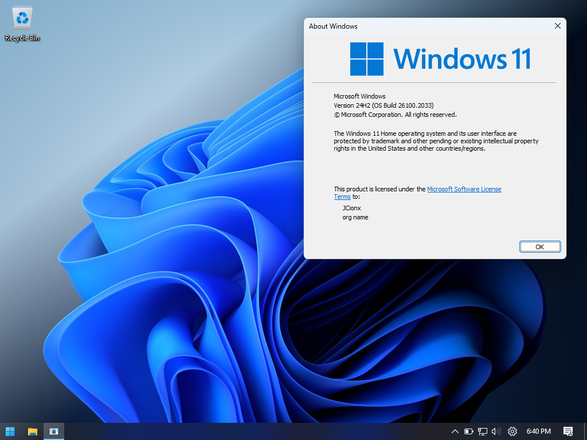
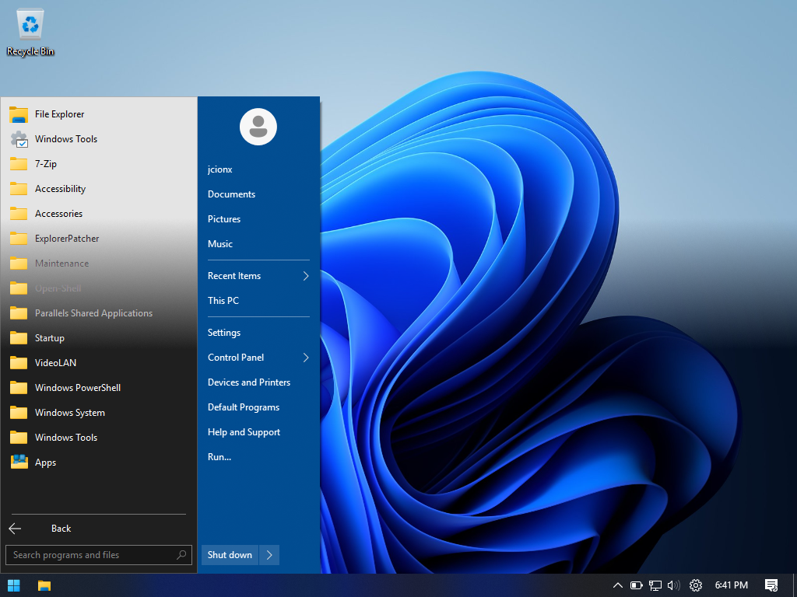

# UWPurge

UWPurge is a PowerShell script that removes almost all Windows UWP apps, and replaces them with faster open-source alternatives.



Windows 11's built-in apps are built on the UWP framework. This framework allows developers to build beautiful apps, but at the cost of performance.By replacing the Windows UWP apps with fast Win32 apps, the Windows experience gets much snappier, specially on weaker hardware.

UWPurge also features a custom taskbar and start menu, because the default taskbar and start menu have UWP components as well.



Tested on:
- Windows 11 Pro

## Installing
Open **PowerShell** as Administrator (not the Windows terminal) and run this:
```powershell
irm https://raw.githubusercontent.com/JCionx/UWPurge/master/UWPurge.ps1 | iex
```

## Credits
Projects used in UWPurge:
- [Win11Debloat](https://github.com/Raphire/Win11Debloat)
- [Open-Shell](https://github.com/Open-Shell/Open-Shell-Menu)
- [ExplorerPatcher](https://github.com/valinet/ExplorerPatcher)
